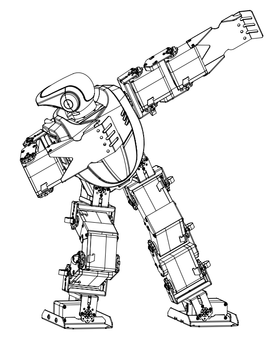

# HBE-ROBONOVA-AI-I-Raspberry-Pi-Opencv-Robot-Tutorial-
Raspberry,Robot, Opencv,Tutorial

树莓派机器人快速入门指南 V1.3  

——带视觉全自主智能人形机器人训练平台 HBE-ROBONOVA-AI II  

本教程基于 HBE-ROBONOVA-AI II， 也可作为树莓派入门参考原创作品， 仅供个人研究使用， 请勿转发！ 谢谢！  

  
